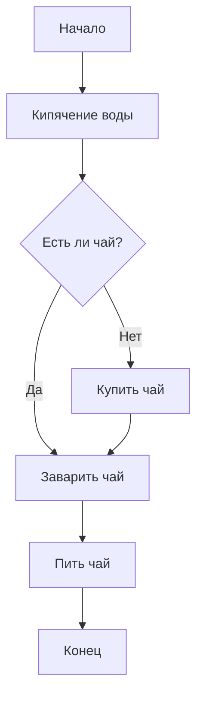
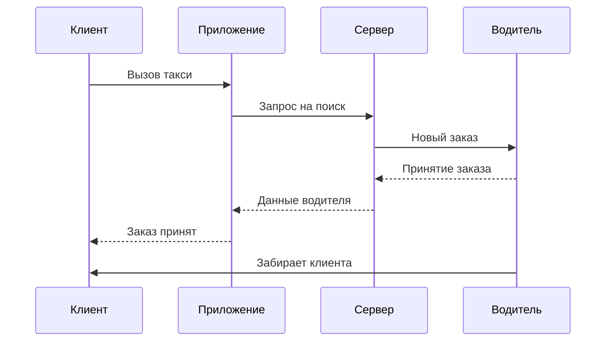
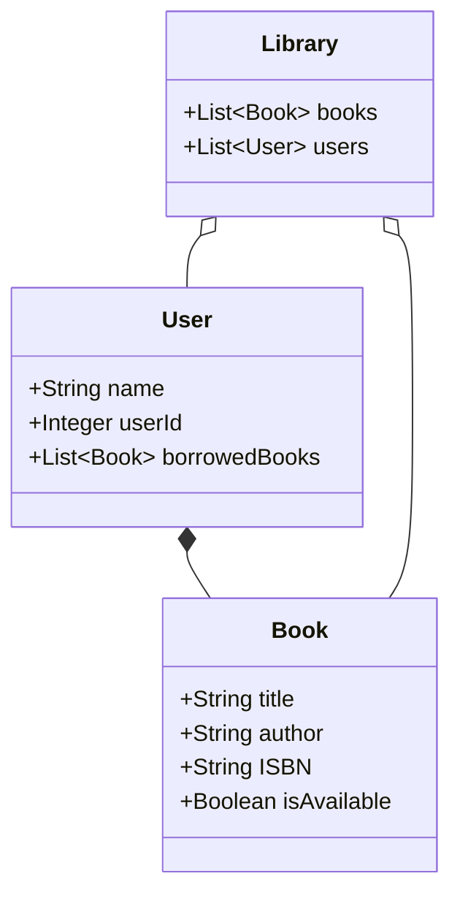
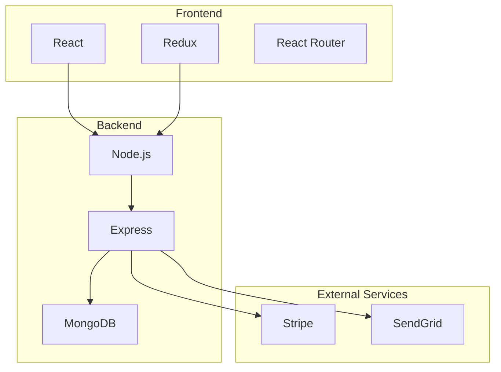
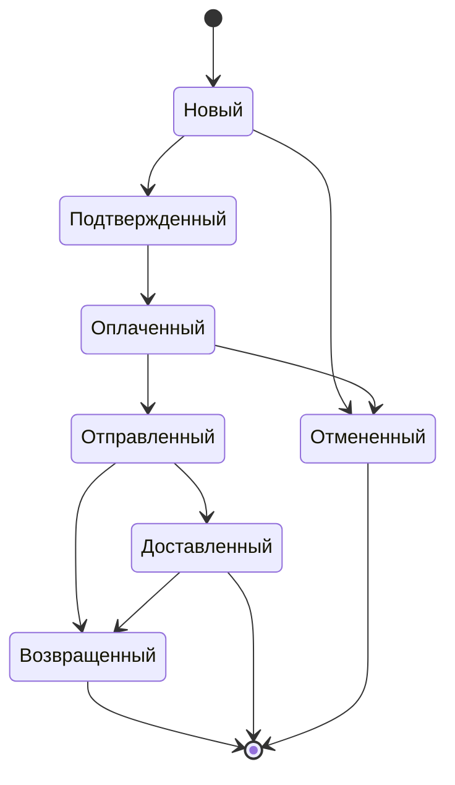
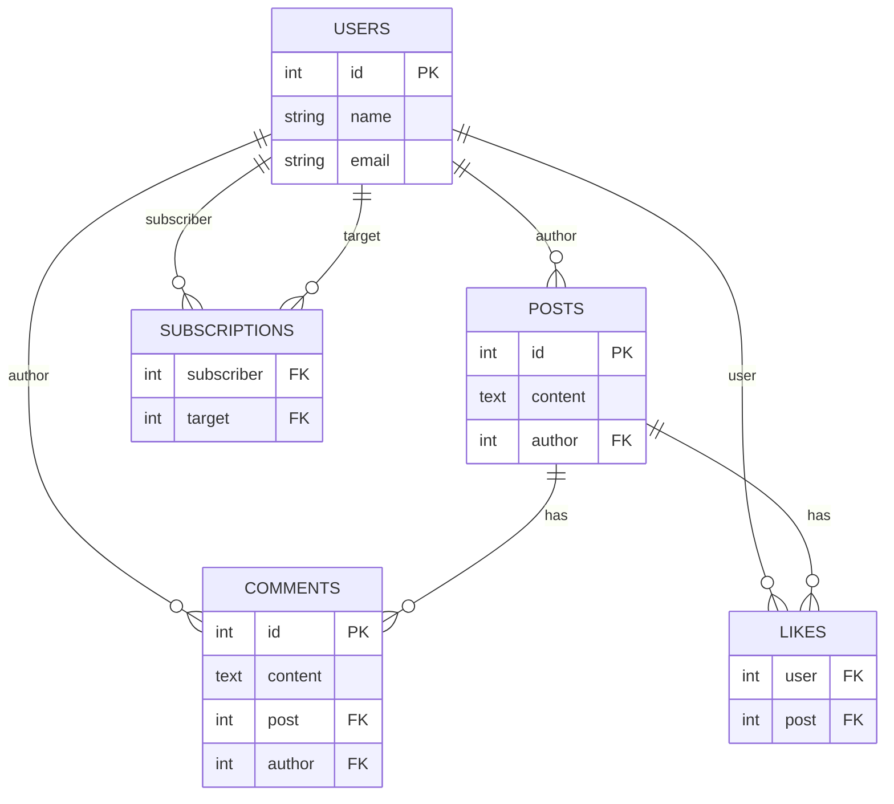
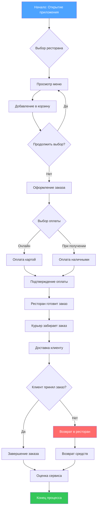
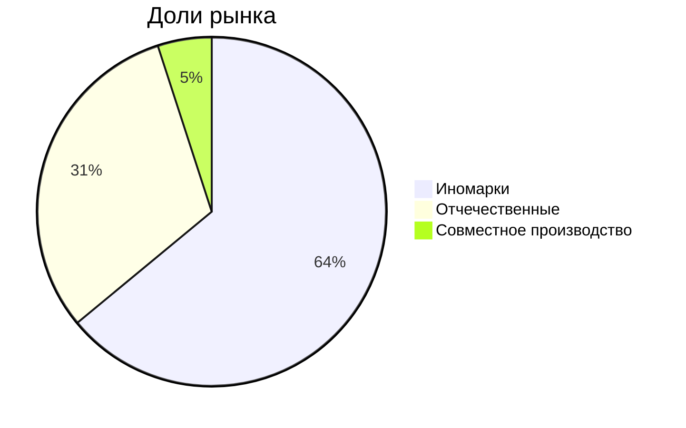

### **Уровень 1: Начальный (Базовый синтаксис)**

#### **Задание 1.1: Простая блок-схема**

---

#### **Задание 1.2: Диаграмма последовательности**

---

### **Уровень 2: Средний (Комплексные диаграммы)**

#### **Задание 2.1: Диаграмма классов UML**

---

### **Уровень 3: Продвинутый**

#### **Задание 3.1: Архитектура приложения**

---

#### **Задание 3.2: Диаграмма состояний**

---

### **Уровень 4: Экспертный (Творческие задания)**

#### **Задание 4.2: ER-диаграмма базы данных**

---

#### **Задание 5: Полная документация проекта**

---

#### **Задание 6: Круговая диагамма**
